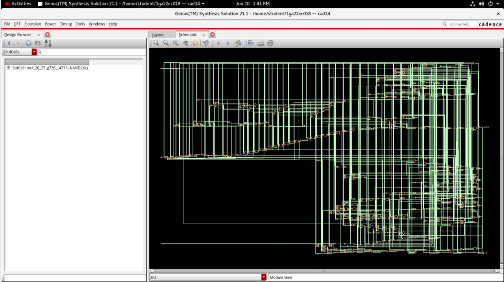
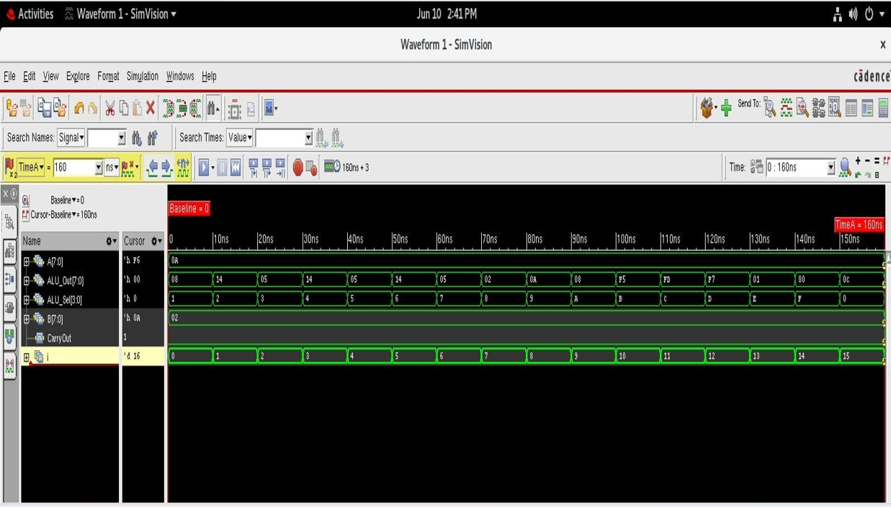
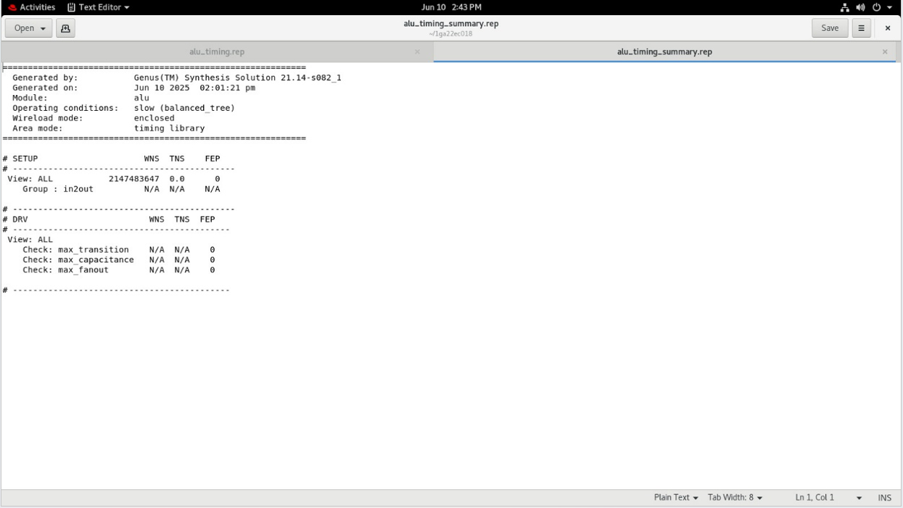
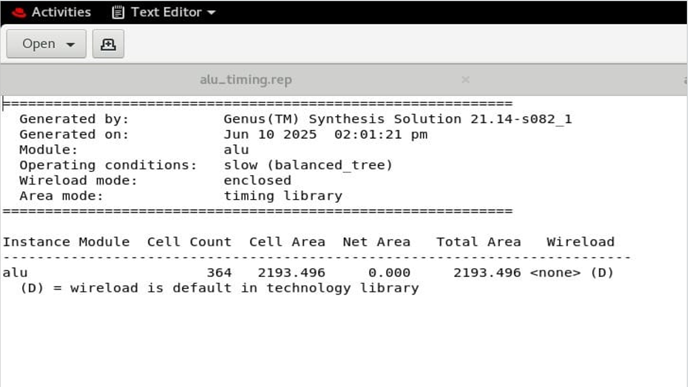
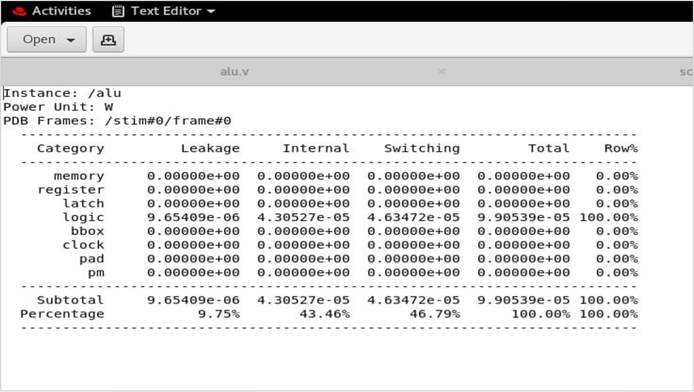

# Simulation of 8-bit ALU Using Cadence Tool

## Project Overview
This project implements and simulates an 8-bit Arithmetic Logic Unit (ALU) using Cadence Virtuoso tools.

## Operations Performed
- Addition
- Subtraction
- Multiplication
- Division
- Logical Shift Left
- Logical Shift Right
- Rotate Left
- Rotate Right
- AND, OR, XOR, NOR, NAND, XNOR

## Tools Used
- Cadence Virtuoso
- Spectre Simulator
- Verilog HDL

## Report of Area,Time and Power
- Using genus "report time" for timing report
- Using genus "report power" for power report
- Using genus "report area" for Area report

## Schematic Diagram

## Output Waveform

## Area Report

## Timing Report

## Power Report

## Applications
- Embedded systems
- Microcontrollers
- IoT devices
- Digital processors

## Skills Demonstrated
- Digital Circuit Design
- Verilog HDL
- ALU Architecture
- IC Simulation
- Cadence Virtuoso
